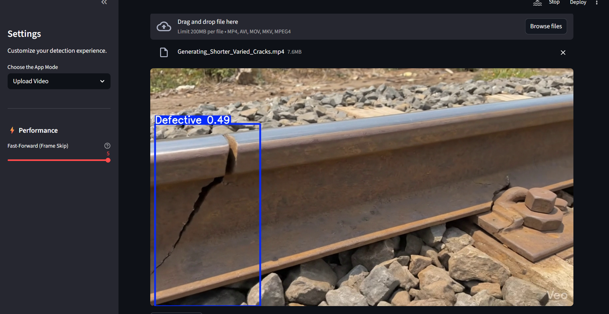

# RailVLM: Real-Time Railway Track Fault Detection

RailVLM is an intelligent real-time railway inspection system designed to detect faults in railway tracks using advanced Artificial Intelligence techniques. 
The system combines high-speed object detection using YOLOv8 with Vision Language Models (VLMs) such as Moondream2 to provide explainable and human-readable diagnostics. 

It automates the detection of defects like cracks, missing fasteners, and obstacles, reducing dependency on manual inspection methods. 
The platform also provides real-time alerts and generates detailed maintenance reports, ensuring faster and more accurate decision-making. 

By integrating computer vision with explainable AI, RailVLM enhances railway safety, minimizes human error, and improves overall inspection efficiency.

# Features (Present / To be added)

- Real-time webcam fault detection
- Fault detection via uploaded video
- Explainable AI analysis of the vault using a VLM (Moondream2)
- Complete fault report PDF generation
- Data storage via SQLite3

# Screenshot

